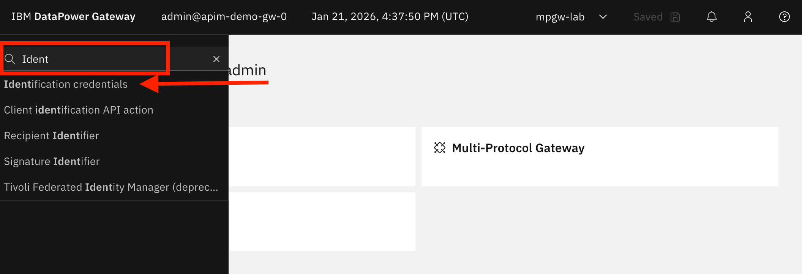
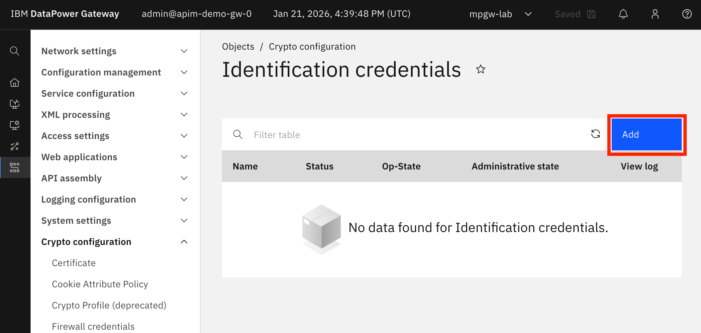
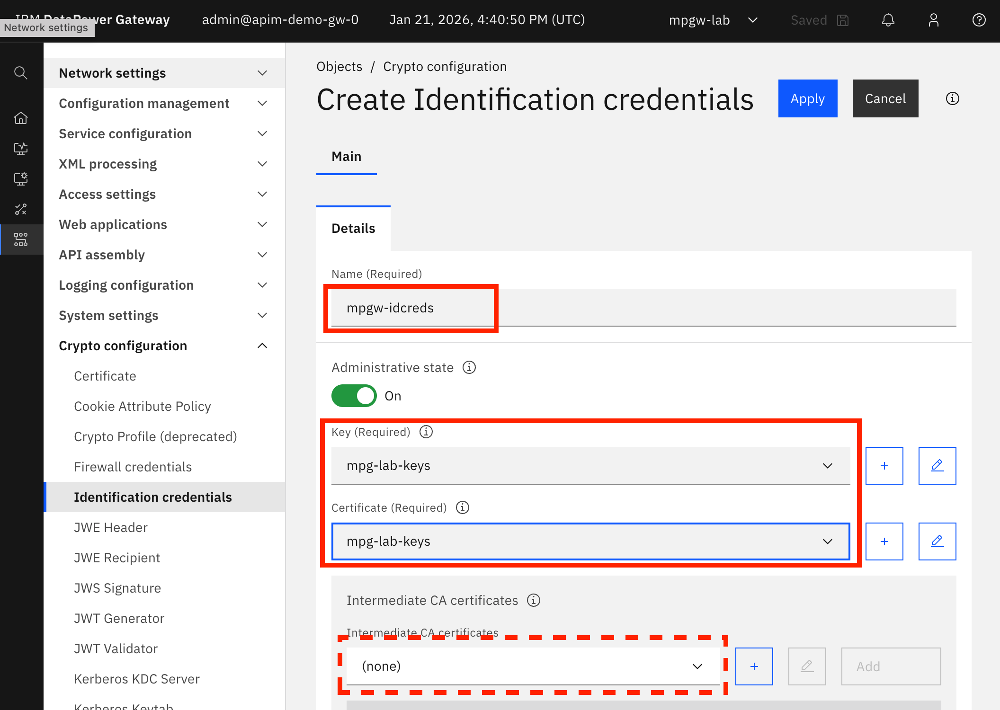
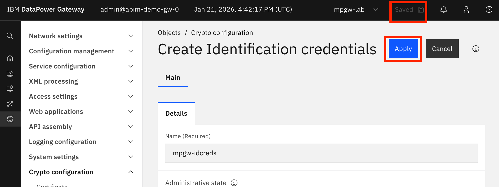
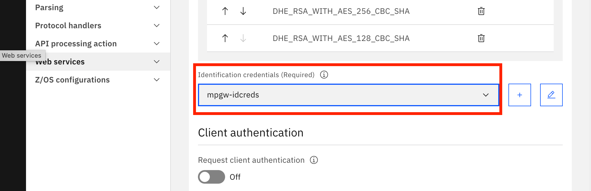

# Configuring Multi-Protocol Gateway with DataPower

_A Step-by-Step Guide_

${toc}

## Introduction

In a world where disruption is the norm, ensuring your environments can support modern protocols like Kafka and AMQP while supporting existing protocols like http and MQ is essential to modernizing your environments.

IBM DataPower is an industry-leading integration solution that is designed to secure and protect your integration solutions. It provides the ability to deploy a variety of services for your solutions. One of the most used services within IBM DataPower is the Multi-Protocol Gateway (MPGW). An MPGW is a flexible, highly configurable endpoint for managing, transforming, and routing various types of network traffic and data formats, acting as a versatile intermediary for handling diverse tasks.

For this Lab we are putting you in the role of a Senior Integration Operations Specialist from Focus Corporation. You are expected to create a Multi-Protocol Gateway that takes https: traffic flowing into a DataPower and convert it to http. The lab will give you the concepts on how to create a Multi-Protocol Gateway that can supports other protocols to converts to protocol your backend might support.

### About this hands-on lab

In the first part of this lab, you will log into an application domain in DataPower. An application domain is a feature that allows the creation of a development partition for services that process requests. The default domain is used by DataPower Gateway to create, modify and control system-wide resources such as network interfaces, users, and control DataPower objects. Application domains can only be created in the default domains. An example is an airline has four lines of business on their DataPower Gateways, Loyalty, Ticketing, Baggage and Revenue. They can partition their DataPower as follows:

In the second part of this lab, you will create a key/cert pair that will used with the Multi-Protocol Gateway. Keys and certs are used for secure communication and authentication.

- Private Key: This key is kept secret and is used to decrypt data encrypted with its corresponding public key, and to create digital signatures.
- Public Key: This key can be shared freely and is used to encrypt data that can only be decrypted by the corresponding private key.
- Key Pairs: A public and private key are mathematically linked and form a key pair.
- Certificate: An electronic document that binds a public key to an identity, a website, a user or an organization.

In the third part of the lab, you will create and configure a multi-protocol gateway that will take https: traffic and converts it to http: traffic.

In the final part of the lab, you will test the multi-protocol gateway using website.
By the end of the lab, you will understand how to create and configure a multi-protocol gateway from the application domain to the method to test multi-protocol gateway using a https: to http: service.

### Architecture

DataPower Multi-Protocol Gateway Architecture

A multiprotocol gateway can accept client-originated messages in various protocols. The service can then pass messages to a remote server with various protocols. The protocol that the client uses does not need to be the same as the protocol that the remote server uses.

A multi-protocol gateway supports the following protocols.

- AMQP
- FTP
- HTTP
- HTTPS
- IBM® MQ
- IMS Callout
- IMS Connect
- Kafka
- MEIG AS2
- NFS
- SFTP
- Stateful raw XML
- Stateless raw XML
- TIBCO EMS
- WebSphere® JMS

A multiprotocol gateway can support more than one client protocol. Similarly, the service can support more than one server protocol.

The following figure provides an illustration of the static server architecture that the service supports.

A multiprotocol gateway can accept client requests through any of the protocol handlers that are shown (HTTP, HTTPS, or IBM MQ). A static URL determines the destination for all traffic. This server-side traffic can employ one of the protocols that are shown (HTTP, HTTPS, or IBM MQ).

When the remote service endpoint is determined dynamically, the multiprotocol gateway supports a stateful raw XML handler. Because the connection is stateful, this protocol handler can communicate with only a remote service that also uses the same protocol. The following figure shows other protocol handlers that can route to the other protocols dynamically.

Taken from IBM DataPower Knowledge Centre - https://www.ibm.com/docs/en/datapower-gateway/10.6.0?topic=development-multi-protocol-gateway

## Login into the DataPower Web Console

1. The login link for the webui is provided on your list of user details.

    ${issue @tdw dataPowerAdminUser and dataPowerAdminPassword is not populated}

    1. Enter `{{ dataPowerAdminUser | admin }}` in the `Username` field
    1. Enter `{{ dataPowerAdminPassword | password }}` into  `Password` field
    1. Select `default` in the `Domain` field
    1. Click `Log in` to log in to DataPower’s Web Console

    

## Create an application domain

As a general best practice, the `default` domain should only be used for administrative tasks. Let's create a new domain for our lab.

1. In the search field in the top left corner, search for `Application` and click `Application domain`. `Application domain` may be listed twice. That's ok; simply click the first one.

    

    Click `Add` in the top left corner.

    

    Give your new Application Domain the name `mpgw-lab` and click `Apply`.

    

    Save your changes. Click `Save`.

    

    Switch to your new Application domain. Click the domain pulldown (labeled with the current domain `default`) and select your new domain.

    

## Create a TLS server profile

A TLS server profile is used to reference the certificate objects that are exposed to request coming into the DataPower.

### Generate a self-signed certificate

You need keys and certificates to do create your TLS server profile. You may provide your own keys, or use DataPower to generate a self-signed certificate. In this section, we'll cover how to do the latter.

1. In the search field in the top left corner, search for `crypto` and click `Crypto tools`.

    

1. Fill in the subject fields for the certificate. You may fill in as many as you like, but only the `CN` field is required.
1. In the `Key type` field, select `ECDSA`.

    

1. Scroll down and enable `Export private key`. This is your only opportunity to export a key; you will not be able to download the key later.
1. Ensure `Generate key and certificate objects` is enabled. It should be enabled by default.
1. Give the objects a name like `mpg-lab-keys`.

    

1. Scroll back up and click `Submit`

    

1. Confirm the confirmation

    

1. Click `Save`

    

### Create a keystore

The keystore, formerly known as "indentification credentials" encapsulates a key and certificate pair.

1. In the search field in the top left corner, search for `key` and click `Keystore (identification credentials)`

    

1. Click `Add`

    

1. Give your keystore a name like `mpgw-idcreds` and select the self-signed key and certificate objects you created in the previous section of this exercise. It's not necessary to select an intermediate certificate with self-signed credentials.

    

1. Click `Apply` and `Save`

    

### Create the TLS server profile

Now that we have a Keystore, let's create a TLS server profile

1. Search for `TLS server profile`.

    

1. Click on the `Add` button

    

1. Give your TLS Server Profile a name like `mpgw-lab-tls-server-profile`.

    

1. Scroll down and select the Keystore object you createed in the previous section.

    

1. Click `Apply` and then `Save`

    

## Create a HTTPS handler

The HTTPS Handler represents the listener at that takes requests into DataPower.

1. Search for `HTTPS Handler`

    

1. Click `Add`

    

1. From Create HTTPS handler page

    1. Give your handler a name, such as `mpgw-lab-handler`.

        

    1. In the Port field, set the port you would like to bind your HTTPS handler to. For the purposes of this lab, Use `10443`. A service and route has already been created in OpenShift to expose that port.

        

    1. For Allowed Methods and versions ensure that GET Method is selected

        

    1. For TLS server type, select Server profile

    1. For the TLS server profile, select the profile you created earlier.

        

    1. Click `Apply` and then `Save`

        

        Note: You will get a message that the handler is down. This is expected.

        

## Create a Multi-Protocol Gateway Policy

The MPGW-Policy is the logic for the call. In this example we are going to set a single variable and call some gateway script. The GatewayScript will set a response payload. Normally this logic can be used to route to downstream endpoints, apply forms of protection.

1. Search for `Multi-Protocol Gateway Policy`

    

1. Click `Add`

    

1. From the Configure Multi-Protocol Gateway Style Policy page:

    1. Give it a name, like `lab-mpgw-policy`
    2. Click `Add` to add a rule

    

1. From the Rule tab,

    1. In the `Rule type` drop-down, select Client to Server.

        

    1. Observe the ⚠️ next to the `Match rule` icon. Click the icon.

        

    1. We need to create a match rule. Click the `+` sign button next to the `Matching Rule` field.

        

    1. Name it `all-uri-paths`, then click on `Add`.

        

    1. Set the URL match to `*` (asterisk) and click `Apply`

        

    1. Observe the URL match rule you just created is listed under `Rules`. Click `Apply`.

        

    1. Observe the `Matching Rule` is set to the rule you just created. Click `Done`

        

    1. Notice the ⚠️ seen earlier is gone.

        

1. Any policy without a backend must have `service/mpgw/skip-backside` set to `. Let's add the policy rule to set that variable value.

    1. Click on the `+` the right of the Match rule icon.

        
    
    1. Scroll down and select `Set Variable`.

        

    1. Observe the ⚠️ next to the new `Set Variable` icon. Click the icon.

        

    1. Set the `Context` to `INPUT`

        

    1. In the `Options` pane, set the following values and then click `Done`:

        - **Select a protocol** to `var://`
        - **Variable name** to `service/mpgw/skip-backside`
        - **Variable value** to `1`

        

1. Now add a GatewayScript policy rule to set a very simple response payload.

    1. Click on the `+` the right of the Set Variable rule icon.

        

    1. Select `GatewayScript`

        

    1. Observe the ⚠️ next to the new `GatewayScript` icon. Click the icon.

        

    1. Upload the file in [resources/gws.js](resources/gws.js).
    
        1. Download the [linked file](resources/gws.js).
        1. Click the upload icon

            

        1. Upload the file. Drag the file from your local OS file manager (e.g. macOS Finder) to the `Drag and drop...` area and click `Upload`.

            
    
    1. Click `Done`.

        

1. One more policy rule is needed to complete the chain: the `Results` rule.

    1. Click on the `+` the right of the GatewayScript rule icon.

      

    1. Select `Results`.

        
    
    1. No further configuration is needed but you may view the options available by clicking the `Results` icon.

        

        Click `×` (cancel) or `Done` to exit. The `Done` button is only activated if there are changes.

        

1. Click `Done`

    

1. Click `Apply Policy` and then `Save`

    

## Create a New Multi-Protocol Gateway

The MPGW brings everything together. The listen is set to determine how it receives traffic and the MPGW-Policy determines how the traffic is processed.

1. Search for `New multi-protocol gateway`

    

1. In the `General Configuration` settings:

    1. Give it a name like `lab-mpgw`
    1. Set **XML Manager** to `default`
    1. Set **Processing policy**`** to the multi-protocol gateway policy we created earlier.
    1. Set **Type** to `Dynamic backend`.

    

1. In the Front side settings

    1. In Front Side Protocol (Required) selection (A) field, select the Front Side handler you created earlier and press the `Add` button.

    

    1. The `[down - Cannot install without a service.]` message is normal at this point. The message will go away when this new multi-protocol gateway setup is completed.

    

1. In the User Agent settings:

    1. Set both **Characterize response traffic** and **Characterize request traffic** to `XML`

    

    2. Toggle Propagate URI to Off

    

1. Click on the `Apply` and `Save`

    

## Testing

In a browser window navigate to the test URL that was provided alongside your credentials.
You should see a response similar to

